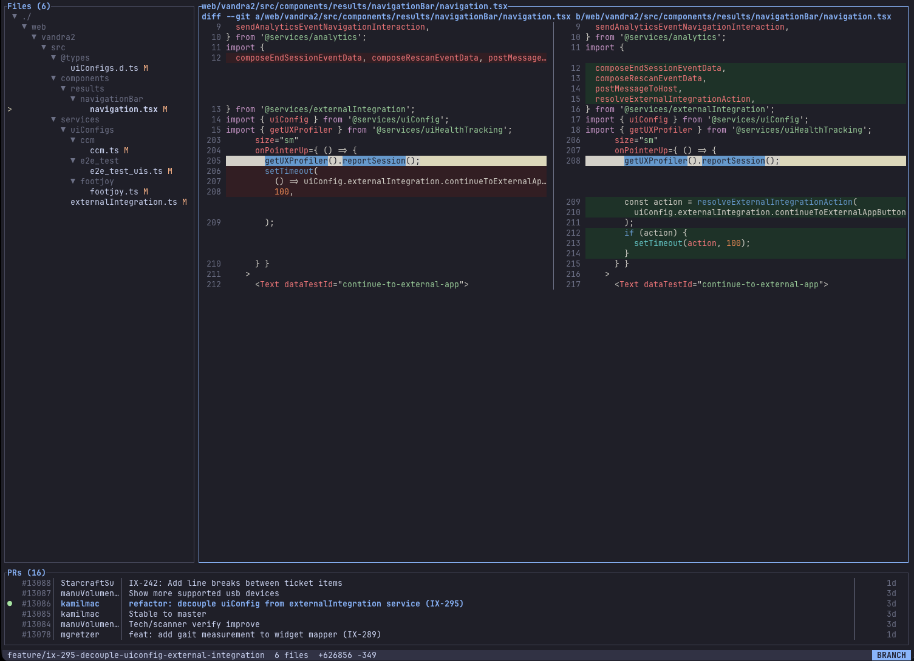
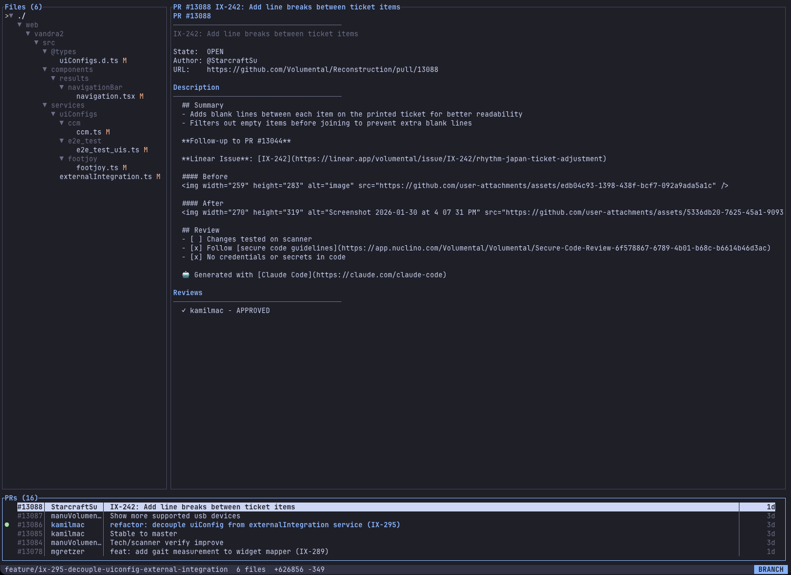

# Kimchi

Terminal UI for reviewing code changes. Built for the AI coding era.

<p>
  
  
</p>

## Why

AI agents commit faster than you can review. This creates problems:

1. **Working tree diff is useless.** Agents commit often. You need diff against base branch — the full picture.
2. **PRs need faster access.** More code, more reviews. Browser switching kills flow.
3. **Code is secondary.** When agents write, you review. The diff is the artifact, not the source file.

Kimchi sits next to your AI agent. Shows changes, refreshes automatically, PRs are a keystroke away.

## Install

```bash
git clone https://github.com/kmacinski/kimchi
cd kimchi
cargo build --release
cp target/release/kimchi ~/.local/bin/
```

## Requirements

- **Git**
- **gh CLI** (optional) — for PR list, reviews, and comments. [Install here](https://cli.github.com/). Without it, PR features are disabled but local git operations work fine.

## Usage

```bash
kimchi              # current directory
kimchi /path/to/repo
```

## Keys

| Key | Action |
|-----|--------|
| `j/k` | Navigate |
| `J/K` | Fast scroll |
| `h/l` | Scroll diff horizontally |
| `g/G` | Top/bottom |
| `Tab` | Switch panes |
| `1-3` | Switch mode |
| `y` | Copy path |
| `o` | Open in $EDITOR |
| `?` | Help |
| `q` | Quit |

**PR actions** (requires `gh`): `a` approve, `x` request changes, `c` comment

## Modes

| `1` changes | All changes vs base branch. `●` marks uncommitted files |
|-------------|----------------------------------------------------------|
| `2` browse | All tracked files |
| `3` docs | Markdown files only |

## License

MIT
